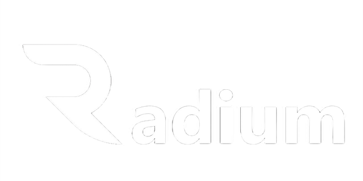

    

    
    
    

# Radium Networking
Radium networking is a simple library coded specifically for the Radium game engine. It is meant to fit in with the rest of the engine and provide a simple way to communicate between clients and servers. This repository will not be exactly like the engine version, but will be a base for it. The code is open source so feel free to use the library for your own personal projects. There is no documentation due to the fact this is for Radium and not an official library.